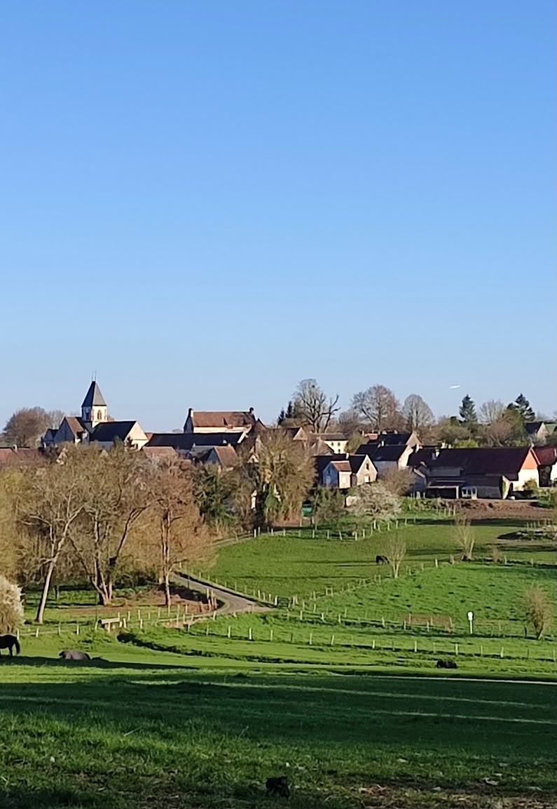

# Autour de Chérence — guide pratique

*Vexin français · Val-d'Oise · repérage août 2026*

Temps de route depuis Chérence (95510), ±5 min selon la saison. Cœur de sélection dans un rayon de 5 à 25 min ; au-delà (Giverny, Auvers-sur-Oise, Pontoise), c'est signalé — ce sont des pépites qui valent le détour. Carte interactive associée : `carte-cherence.html`.

Un village de cent soixante âmes posé sur le plateau, maisons de pierre et grand ciel, juste au-dessus des falaises de craie qui plongent vers la Seine. On rayonne d'ici : à pied sur le plateau et jusqu'à la crête, ou en voiture vers les boucles du fleuve et le pays des impressionnistes. L'**église Saint-Denis** (celle de la photo) veille sur tout ça — nef romane parmi les plus anciennes du Vexin, agrandie au XVIe d'un ensemble Renaissance, classée monument historique ; son clocher trapu se repère de loin dans la campagne.

---

## 🍽️ La table

### Curiosité et Gourmandise — €€
~10 min · 6-8 Grande Rue, 95510 Vétheuil · [Itinéraire](https://www.google.com/maps/search/?api=1&query=Curiosite+et+Gourmandise+Vetheuil)
À dix minutes de Chérence, dans le village que Monet a peint, une petite table qui joue les textures et les saveurs sans se prendre au sérieux. Menu au fil du marché, cadre feutré, addition raisonnable pour ce qui arrive dans l'assiette. **Fermé lundi-mardi · vérifier l'ouverture avant de venir.**

### Crêperie La Cancalaise — 3,8★ (256 avis) · €
~10 min · 18 rue du Général Leclerc, 95780 La Roche-Guyon · [Itinéraire](https://www.google.com/maps/search/?api=1&query=La+Cancalaise+La+Roche-Guyon)
La halte simple et gourmande au pied du château : galettes bien garnies, crêpes caramel beurre salé, terrasse pour souffler après la balade sur les hauteurs. Sans façon, parfait en famille.

### La Pétille — 4,1★ (203 avis) · €€
~20 min · 27 place d'Armes, 95420 Magny-en-Vexin · 01 34 67 27 58 · [Itinéraire](https://www.google.com/maps/search/?api=1&query=La+Petille+Magny-en-Vexin)
La bonne table de bourg du Vexin : produits frais du coin, plats généreux, cheminée l'hiver et terrasse l'été sur la place d'Armes. Accueil familial, en tête du classement local. On repart calé sans casser sa tirelire.

### Le Jardin des Plumes — 4,6★ (1383 avis) · €€€€
~25 min · 1 rue du Milieu, 27620 Giverny · [Site officiel](https://jardindesplumes.fr/) · [Itinéraire](https://www.google.com/maps/search/?api=1&query=Le+Jardin+des+Plumes+Giverny)
La grande table du secteur, une étoile fidèle au poste : la cuisine créative et précise de David Gallienne dans une maison anglo-normande à deux pas des jardins de Monet. Patio, jardin arboré, poissons de Dieppe. Le repas qu'on s'offre pour marquer le séjour. **Fermé lundi-mardi (à vérifier).**

### Oscar — 4,2★ (851 avis) · €€€
~30 min · 99 rue Claude Monet, 27620 Giverny · 06 10 38 30 49 · [Site officiel](https://oscargiverny.com) · [Itinéraire](https://www.google.com/maps/search/?api=1&query=Oscar+restaurant+Giverny)
Le bistrot gourmand de David Gallienne — le chef étoilé du Jardin des Plumes — niché dans les jardins du Musée des impressionnismes, à deux pas de la maison de Monet. Des assiettes qui rappellent les goûts d'enfance, des produits normands parfois cueillis au potager, un piano en accès libre et un bar central pour prolonger la soirée. **Avr.-oct. · midi tous les jours, soir ven.-sam. · fermé nov.-mars.**

### Ancien Hôtel Baudy — 4,2★ (3129 avis) · €€

~25 min · 81 rue Claude Monet, 27620 Giverny · [Itinéraire](https://www.google.com/maps/search/?api=1&query=Ancien+Hotel+Baudy+Giverny)
Pousser la porte de l'auberge où déjeunaient Cézanne, Renoir et les peintres américains : ambiance impressionniste intacte, roseraie à flanc de colline et atelier d'artiste au fond du jardin. Cuisine normande simple et généreuse. On y vient autant pour le lieu que pour l'assiette. **En saison (avril-oct.), fermé l'hiver (à vérifier).**

### Blossom Bistrot — 4,5★ (145 avis) · €€
~20 min · 35 quai Anatole Caméré, 27200 Vernon · [Site officiel](https://www.blossombistrot.fr/) · [Itinéraire](https://www.google.com/maps/search/?api=1&query=Blossom+Bistrot+Vernon)
Petit bistrot posé au bord de Seine, face aux falaises crayeuses de Giverny, où le chef revisite les classiques au gré du marché. Béton ciré, ardoise qui change chaque jour, assiette fine et fraîche. Une jolie pépite repérée par le Michelin. **Horaires variables selon saison (à vérifier).**

---

## 🍸 Bars & cafés

### La Grotte à Bières — 4,5★ (485 avis)
~8 min · 18 rue de la Vieille Charrière de Gasny, 95780 La Roche-Guyon · 06 80 12 54 40 · [Itinéraire](https://www.google.com/maps/search/?api=1&query=La+Grotte+a+Bieres+La+Roche-Guyon)
Une cave creusée dans la falaise de craie, guirlandes lumineuses et vieux tonneaux en guise de tables. Plus de 160 bières à dénicher, une planche de charcuterie posée entre amis, la roche tout autour qui garde le frais. L'adresse la plus insolite du secteur. **Fermé lundi · 16h-21h en semaine, plus large le week-end.**

### Le Relais du Château — 4,2★ (1764 avis)
~8 min · 9 rue du Général Leclerc, 95780 La Roche-Guyon · [Itinéraire](https://www.google.com/maps/search/?api=1&query=Le+Relais+du+Chateau+La+Roche-Guyon)
La terrasse ombragée sur la place, au pied du château, pour la bière d'après-balade. Brasserie de famille sans chichi : coin bar chaleureux, cuisine maison, prix honnêtes. On s'assoit et on regarde vivre le village.

### Maison Coquelin — 4,8★ (24 avis)
~8 min · 3 rue de Gasny, 95780 La Roche-Guyon · [Itinéraire](https://www.google.com/maps/search/?api=1&query=Maison+Coquelin+La+Roche-Guyon)
Un verre ou un cocktail sur la petite terrasse, entre galerie d'art et salon de thé, à deux pas du château. Adresse soignée, accueil chaleureux, sushis maison si l'apéro s'éternise.

### La Capucine — Giverny — 3,7★ (653 avis)
~25 min · 80 rue Claude Monet, 27620 Giverny · 09 88 99 61 35 · [Site officiel](https://www.lacapucinegiverny.fr) · [Itinéraire](https://www.google.com/maps/search/?api=1&query=La+Capucine+Giverny)
Ancien pressoir devenu café-jardin à quelques mètres des jardins de Monet : on boit son verre au milieu des plantes, à l'ombre. Happy hour en fin de journée, quand les cars de touristes sont repartis. Simple, vert, reposant. **Tous les jours 10h-18h · happy hour 18h-20h.**

### La Guinguette de Giverny — 4,1★ (169 avis) · €€

~30 min · 6 route de Falaise, 27620 Giverny · 06 72 76 03 66 · [Site officiel](https://laguinguettedegiverny.com) · [Itinéraire](https://www.google.com/maps/search/?api=1&query=La+Guinguette+de+Giverny)
Les pieds presque dans l'eau, sur une terrasse ombragée au bord d'un bras de l'Epte — le paysage exact que Monet peignait à 300 m de là. En face, les vaches viennent brouter dans la prairie et vous dire bonjour, les truites glissent sous la surface. Une vraie parenthèse guinguette, d'avril à septembre, sans réservation. **Avr.-sept. · déj. mer.-dim., dîner jeu.-sam. · sans réservation.**

### Café de la Place — Moisson — 4,0★ (1340 avis)
~25 min (traverser la Seine) · 2 route de Lavacourt, 78840 Moisson · [Itinéraire](https://www.google.com/maps/search/?api=1&query=Cafe+de+la+Place+Moisson)
Le vrai café de village dans la boucle de la Seine : comptoir, terrasse, poulet rôti le week-end. On y croise les habitants plus que les touristes. Franchir la Seine vaut le détour rien que pour l'ambiance bistrot. **Fermé lundi · 7h-21h, plus tard ven.-sam.**

### Chez Édith
~12 min · Près de la place de l'Église, 95510 Vétheuil · [Itinéraire](https://www.google.com/maps/search/?api=1&query=Chez+Edith+Vetheuil)
Le café-restaurant du village où Monet a vécu : grillades et plat du jour à l'ardoise. Terrasse pour les beaux jours, salle chaleureuse quand il pleut. Une halte simple et sans façon entre deux boucles de Seine.

---

## 🧺 Producteurs & marchés

### Ferme de Vaulézard
~10 min · RD 913, 95510 Vienne-en-Arthies · 06 61 91 31 82 · [Itinéraire](https://www.google.com/maps/search/?api=1&query=Ferme+de+Vaulezard+Vienne-en-Arthies)
La ferme bio la plus proche de Chérence : chèvres au grand air, lait transformé sur place en crottins, tommes et yaourts. On repart aussi avec œufs fermiers, miels et pain d'épices maison. La boutique aligne les produits des voisins — un petit tour du Vexin en une visite. **Vente ven. 15h-19h, sam. 14h-19h, dim. 10h-12h30.**

### Potager-fruitier du Château
~6 min · 1 rue de l'Audience, 95780 La Roche-Guyon · 01 34 79 74 42 · [Site officiel](https://www.chateaudelarocheguyon.fr/le-potager-fruitier/) · [Itinéraire](https://www.google.com/maps/search/?api=1&query=Potager+fruitier+Chateau+La+Roche-Guyon)
Un potager du XVIIIe blotti dans ses murs au bord de Seine, 32 parcelles et 675 arbres fruitiers menés en bio. Les légumes de saison partent à la boutique du château de juillet à octobre ; le reste file en confitures et jus. On descend chercher son panier au pied des falaises. **Boutique 10h-18h · légumes en vente juil.-oct.**

### Quai des Pains — 4,1★ (120 avis)
~6 min · 1 rue du Général Leclerc, 95780 La Roche-Guyon · 01 34 79 71 56 · [Site officiel](https://quaidespains.com) · [Itinéraire](https://www.google.com/maps/search/?api=1&query=Quai+des+Pains+La+Roche-Guyon)
La boulangerie de La Roche-Guyon, la plus proche de Chérence. Farines choisies, fermentations lentes au levain : la tradition et les pains spéciaux font l'unanimité, viennoiseries dans la foulée. L'arrêt croissant du matin avant la falaise. **Fermé lundi · 7h-19h.**

### Cueillette d'Aincourt
~15 min · 5 rue Boulangère, 95510 Aincourt · 01 34 76 71 14 · [Itinéraire](https://www.google.com/maps/search/?api=1&query=Cueillette+d%27Aincourt)
Cueillir soi-même en plein Parc du Vexin : fraises, framboises et groseilles au bout des doigts, puis tomates, salades et petits pois à ramasser panier au bras. Prix de saison, fraîcheur imbattable, et les enfants adorent. D'avril à septembre, jamais le mardi. **Avr.-sept. · 9h-12h & 14h-19h · fermé mardi.**

### Ferme des Champs Verts
~15 min · 19 rue d'Arthies, 95510 Aincourt · 06 82 58 34 84 · [Itinéraire](https://www.google.com/maps/search/?api=1&query=Ferme+des+Champs+Verts+Aincourt)
Depuis 1982, la famille cultive fraises et fruits rouges en plein champ à Aincourt. Tout se transforme sur place, sans additif : pétillant de fraise bluffant, sirops, coulis et confitures. Vente directe surtout en mai-juin, sinon sur rendez-vous. **Vente mai-juin · hors saison sur RDV.**

### Bee Api Vexin
~25 min · 4 route de Gadancourt, 95450 Avernes · 06 20 86 10 90 · [Itinéraire](https://www.google.com/maps/search/?api=1&query=Bee+Api+Vexin+Avernes)
Éric et sa cinquantaine de ruches essaimées de village en village dans le Vexin. Au bout du jardin on goûte les miels de printemps, toutes fleurs, forêt ou châtaignier, avant de craquer sur les nougats et le pain d'épices. Vente le samedi après-midi. **Vente directe sam. 14h-18h.**

### Ferme Brasserie du Vexin
~30 min · 3 rue Croix Ruelles, 95450 Théméricourt · [Site officiel](https://www.biere-du-vexin.com/) · [Itinéraire](https://www.google.com/maps/search/?api=1&query=Ferme+Brasserie+du+Vexin+Themericourt)
Trois générations de céréaliers qui brassent leur propre orge depuis 2001. La Bière du Vexin se décline en blonde, ambrée, blanche non filtrée et une Véliocasse au miel. La boutique de ferme aligne aussi jus de pomme, cidre, moutarde et miel du coin. Le week-end seulement. **Sam. & dim. 10h30-12h30 & 14h30-18h.**

### Ferme du Colimaçon
~30 min · Route de la Chartre, 78250 Oinville-sur-Montcient · 01 34 75 33 89 · [Site officiel](https://www.fermeducolimacon.fr/) · [Itinéraire](https://www.google.com/maps/search/?api=1&query=Ferme+du+Colimacon+Oinville-sur-Montcient)
Plus de 30 ans d'héliciculture au cœur du Vexin : escargots élevés et cuisinés sur place, à l'ail et au persil frais. En coquilles, sur croûtons ou en feuilletés, prêts pour l'apéro. Visites-dégustation possibles, de la bave à l'assiette. **Vente ven. 17h-19h, sam. 10h-12h30 & 15h-19h · RDV avr.-août.**

### Marché de Magny-en-Vexin
~20 min · Place de la Halle, 95420 Magny-en-Vexin · [Itinéraire](https://www.google.com/maps/search/?api=1&query=Marche+Magny-en-Vexin+Place+de+la+Halle)
Le marché de la petite capitale du Vexin, sous et autour de la halle. Maraîchers, fromagers et producteurs du plateau le samedi matin : le rendez-vous ravitaillement de la semaine, à combiner avec une flânerie dans le bourg ancien. **Samedi 8h-13h.**

### Grand Marché de Vernon
~20 min · Place du Général de Gaulle et alentours, 27200 Vernon · [Site officiel](https://www.vernon27.fr/la-ville/commerces-de-proximite/les-marches/) · [Itinéraire](https://www.google.com/maps/search/?api=1&query=Grand+Marche+de+Vernon)
Le grand marché normand de la vallée, sur trois places du centre à colombages. Étals débordants — primeurs, fromagers, rôtisseurs — le samedi matin, plus petit le mercredi. Idéal en aller-retour avec Giverny, juste à côté. **Samedi 8h-14h30 · mercredi 8h-13h.**

---

## 🎨 Culture — musées, châteaux, maisons d'artistes

### Église Saint-Denis de Chérence

à pied depuis le centre · Rue de l'Église, 95510 Chérence · [Itinéraire](https://www.google.com/maps/search/?api=1&query=Eglise+Saint-Denis+Cherence)
Le clocher qui se repère de loin dans la campagne du plateau — celui de la photo. Une nef romane parmi les plus anciennes du Vexin, agrandie au XVIe d'un bel ensemble Renaissance, classée monument historique. Dedans, une Vierge à l'Enfant en pierre du XVe et une cloche de bronze de 1591.

### Cimetière de Chérence
à pied depuis le centre · Rue des Jardins, 95510 Chérence · [Itinéraire](https://www.google.com/maps/search/?api=1&query=cimetiere+de+Cherence+95510)
Sous le plateau reposent quelques grands noms : l'écrivaine Nathalie Sarraute, figure du Nouveau Roman, et le peintre Eugène Galien-Laloue, célèbre pour ses vues de Paris sous la pluie et la neige. Non loin, Eugène et Maria Jolas, fondateurs de la revue moderniste « transition » et proches de James Joyce. Un petit cimetière de village qui a discrètement attiré tout un cercle d'artistes.

### Château de La Roche-Guyon — 4,5★ (4300 avis)

~7 min · ~9,50 € · 1h30-2h · 1 rue de l'Audience, 95780 La Roche-Guyon · 01 34 79 74 42 · [Site officiel](https://www.chateaudelarocheguyon.fr) · [Itinéraire](https://www.google.com/maps/search/?api=1&query=Chateau+de+La+Roche-Guyon)
Un donjon médiéval accroché à la falaise de craie, des galeries troglodytes creusées dans le roc, un escalier taillé jusqu'au sommet. On grimpe pour la vue sur la boucle de la Seine, on ressort par les casemates aménagées par Rommel. **Tous les jours 10h-18h (avr.-nov.).**

### Fondation Claude Monet (Giverny) — 4,6★ (21844 avis)

~30 min · ~11 € · 1h30-2h · 84 rue Claude Monet, 27620 Giverny · 02 32 51 28 21 · [Site officiel](https://fondation-monet.com) · [Itinéraire](https://www.google.com/maps/search/?api=1&query=Fondation+Claude+Monet+Giverny)
La maison rose aux volets verts et le jardin que Monet a peint sans relâche : le Clos Normand qui déborde de fleurs, le pont japonais, l'étang aux nymphéas. Réserver et venir tôt. Ferme l'hiver. **Tous les jours 10h-18h (avr.-1er nov.) · fermé l'hiver.**

### Musée des impressionnismes Giverny — 4,2★ (3163 avis)
~30 min · ~12 € · 1h-1h30 · 99 rue Claude Monet, 27620 Giverny · [Site officiel](https://www.mdig.fr) · [Itinéraire](https://www.google.com/maps/search/?api=1&query=Musee+des+impressionnismes+Giverny)
Un musée clair posé au milieu des jardins de Giverny, dédié aux impressionnismes et à leurs héritiers. Les expositions temporaires changent chaque saison, à deux pas de chez Monet. **Tous les jours 10h-18h (fin mars-1er nov.).**

### Maison de Van Gogh (Auberge Ravoux) — 4,3★ (598 avis)

~45 min · ~10 € · 45 min-1h · Place de la Mairie, 95430 Auvers-sur-Oise · 01 30 36 60 60 · [Site officiel](https://www.maisondevangogh.fr) · [Itinéraire](https://www.google.com/maps/search/?api=1&query=Maison+de+Van+Gogh+Auberge+Ravoux+Auvers-sur-Oise)
La chambre n°5, mansardée et nue, où Van Gogh passa ses 70 derniers jours et peignit plus de 70 toiles. On monte l'escalier de l'auberge, on s'arrête devant la petite pièce restée vide : bouleversant de sobriété. **Merc.-dim. 10h-18h · saison mars-nov.**

### Château d'Auvers-sur-Oise

~45 min · ~12 € · 1h30 · Rue de Léry, 95430 Auvers-sur-Oise · 01 34 48 48 48 · [Site officiel](https://www.chateau-auvers.fr) · [Itinéraire](https://www.google.com/maps/search/?api=1&query=Chateau+d%27Auvers-sur-Oise)
Derrière la façade classique, un parcours immersif projette la naissance de l'impressionnisme, mur à mur, avec la voix de Jacques Gamblin en fil rouge. Les jardins à l'italienne se visitent gratuitement. **Mar.-dim. 10h-18h · jardins 9h-19h.**

### Musée de l'Absinthe
~45 min · ~6 € · 45 min · 44 rue Callé, 95430 Auvers-sur-Oise · 01 42 42 82 55 · [Site officiel](https://musee-absinthe.com) · [Itinéraire](https://www.google.com/maps/search/?api=1&query=Musee+de+l%27Absinthe+Auvers-sur-Oise)
Deux salles bourrées d'affiches, de cuillères percées et de fontaines : tout l'imaginaire de la fée verte qui enivrait les peintres d'Auvers. Petit, décalé, attachant. **Merc.-ven. 13h30-18h30, sam.-dim. 11h30-21h.**

### Maison-atelier de Daubigny
~45 min · ~7 € · 45 min · 61 rue Daubigny, 95430 Auvers-sur-Oise · 01 34 48 03 03 · [Site officiel](https://www.atelier-daubigny.com) · [Itinéraire](https://www.google.com/maps/search/?api=1&query=Maison-atelier+de+Daubigny+Auvers-sur-Oise)
L'atelier du paysagiste Daubigny, où Corot et Daumier ont peint à même les murs. 200 m² de décors intacts, ouverts seulement le week-end : une intimité rare. **Sam.-dim. 10h30-12h30 & 14h-18h30 · Pâques-Toussaint.**

### Domaine de Villarceaux — 4,6★ (525 avis)

~18 min · Gratuit · 1h30-2h · Château de Villarceaux, 95710 Chaussy · [Itinéraire](https://www.google.com/maps/search/?api=1&query=Domaine+de+Villarceaux+Chaussy)
Deux châteaux dans 70 hectares : un manoir médiéval au bord de l'eau, un pavillon perché, des jardins remarquables qui dévalent en terrasses jusqu'aux étangs. Entrée gratuite, on flâne des heures. **Mar.-dim. 14h-18h (avr.-1er nov.).**

### Musée Camille Pissarro (Pontoise)
~45 min · ~7 € · 1h · 17 rue du Château, 95300 Pontoise · 01 30 73 90 77 · [Site officiel](https://ville-pontoise.fr/le-musee-dart-et-dhistoire-pissarro-pontoise-mahpp) · [Itinéraire](https://www.google.com/maps/search/?api=1&query=Musee+Camille+Pissarro+Pontoise)
Sur la butte du vieux Pontoise, une belle demeure consacrée à Pissarro, qui a tant peint ces coteaux. Petit musée, jardin en balcon sur l'Oise, collection qui vaut le détour — à combiner avec Auvers, tout proche. **Merc.-dim. 11h-12h30 & 13h30-18h.**

### Musée du Vexin français

~35 min · ~4 € · 1h · Maison du Parc, 2 rue Achim d'Abos, 95450 Théméricourt · 01 34 48 66 00 · [Itinéraire](https://www.google.com/maps/search/?api=1&query=Musee+du+Vexin+francais+Themericourt)
Dans les communs du château de Théméricourt, le musée raconte le Vexin : sa craie, ses vergers, ses villages de pierre blonde. Une bonne mise en bouche avant d'arpenter le plateau. **Mar.-dim. · fermé lun. et tout décembre.**

---

## 🌾 Grand air — Seine, plateau, planeur

### Vol à voile — Aérodrome de Chérence

~5 min · vol d'initiation ~20-30 min · ≈ 70-80 € (approx., à confirmer) · Aérodrome de Mantes-Chérence (LFFC), 95510 Chérence · 06 98 76 13 33 · [Site officiel](http://www.aavo.org/) · [Itinéraire](https://www.google.com/maps/search/?api=1&query=Aerodrome+de+Mantes+Cherence)
Se faire treuiller au ras du plateau puis basculer d'un coup au-dessus du vide : la Seine s'enroule 130 m plus bas et les falaises de craie défilent en silence, moteur coupé. Une vingtaine de minutes en planeur biplace avec un instructeur, diplôme de vol à l'atterrissage. La sensation forte du coin, juste au-dessus du village. **Selon météo, printemps-automne · sur réservation.**

### Montgolfière du Vexin

à pied depuis le centre · baptême ~250-280 € (approx.) · ~3h dont ≈1h de vol · 15 rue de la Coursoupe, 95510 Chérence · 06 09 37 84 15 · [Site officiel](https://www.vexinmontgolfiere.fr) · [Itinéraire](https://www.google.com/maps/search/?api=1&query=Montgolfiere+du+Vexin+Cherence)
Décoller au lever ou au coucher du soleil et flotter en silence au-dessus des boucles de la Seine, de La Roche-Guyon et des toits de Giverny. Environ une heure portée par le vent, la vallée qui s'étire jusqu'aux falaises. Une base tenue depuis 2012 par un pilote installé au village. **Sur réservation · vols au lever ou au coucher du soleil.**

### Point de vue de la Route des Crêtes
~5 min (ou à pied par le GR2) · gratuit · accès libre · [Itinéraire](https://www.google.com/maps/search/?api=1&query=Route+des+Cretes+Cherence+La+Roche-Guyon)
La petite route de crête serpente au ras de la falaise et, sans prévenir, tout s'ouvre : la boucle de la Seine, La Roche-Guyon blottie sous son donjon, la forêt de Moisson à perte de vue. Lumière rasante magique en fin de journée. On se gare, on regarde, c'est gratuit. **Toute l'année (route D100).**

### Réserve des Coteaux de la Seine
~10 min · gratuit · ~2 km, ~1h · Départ près de l'église troglodytique, 95780 Haute-Isle · [Itinéraire](https://www.google.com/maps/search/?api=1&query=Eglise+troglodytique+Haute-Isle)
Un sentier d'interprétation grimpe dans les pelouses calcaires et les bois accrochés à la falaise, refuge d'orchidées sauvages et de papillons rares, avec des trouées plongeantes sur le fleuve. Boucle d'environ 2 km le long du GR2. Cœur de réserve fermé du 1er mars au 30 juin : on reste sur les sentiers balisés. **Sentiers libres · cœur de réserve interdit 1er mars-30 juin.**

### Boucle Chérence – La Roche-Guyon (GR2)
à pied (départ du village) · gratuit · ~5,8 km, ~2h, +150 m · Départ centre du village, 95510 Chérence · [Itinéraire](https://www.google.com/maps/search/?api=1&query=Cherence+La+Roche-Guyon+randonnee)
Une boucle facile qui part du village perché, traverse bois et champs puis redescend par les coteaux jusqu'à La Roche-Guyon et son château au bord de l'eau. Des vues sur les méandres tout du long, et le retour par la crête. Le classique du plateau, à faire en famille. **Accès libre (éviter mars-juin dans la partie réserve).**

### Arboretum de La Roche-Guyon

~12 min · gratuit · 1h à 2h · Forêt régionale, au nord du village, 95780 La Roche-Guyon · [Itinéraire](https://www.google.com/maps/search/?api=1&query=Arboretum+de+La+Roche-Guyon)
Douze hectares où chaque massif d'arbres raconte un coin d'Île-de-France : hêtres, érables, chênes plantés comme une carte vivante de la région. Allées calmes, ombre fraîche l'été, couleurs de feu à l'automne. Ouvert tous les jours, gratuit. **Accès libre tous les jours.**

### Canoë sur la Seine — Canoseine
~15 min · 1h à 2h30 · 30-70 € selon parcours · Embarcadère du bac, place de la Mairie, 95510 Vétheuil · 06 79 69 48 42 · [Site officiel](https://www.valdoise-tourisme.com/fiches/canoseine-vexin-aventure/) · [Itinéraire](https://www.google.com/maps/search/?api=1&query=Canoseine+Vetheuil)
Glisser en canoë canadien au pied des falaises blanches, sur un bras de Seine calme et sans bateau à moteur — exactement les paysages que peignait Monet. Une à deux heures et demie en autonomie, on s'arrête nager ou pique-niquer où l'envie prend. Départ de l'embarcadère de Vétheuil. **En saison, sur réservation.**

### Île de loisirs des Boucles de Seine
~25 min · entrée 5 €/pers · activités en supplément · Route de Mousseaux, 78840 Moisson · 01 30 33 97 80 · [Site officiel](https://bouclesdeseine.iledeloisirs.fr/) · [Itinéraire](https://www.google.com/maps/search/?api=1&query=Ile+de+loisirs+Boucles+de+Seine+Moisson)
Une vraie plage de sable et un grand lac de 22 ha au cœur de la forêt de Moisson : baignade surveillée l'été, voile, paddle, aviron, et un parcours accrobranche avec son saut de 12 m dans le vide. De quoi tenir toute une journée en famille. **Parc 9h-18h mai-sept. · baignade surveillée juil.-août.**

---

## 🏘️ Villages de caractère

### La Roche-Guyon

~8 min · 95780 La Roche-Guyon · [Site officiel](https://www.chateaudelarocheguyon.fr/) · [Itinéraire](https://www.google.com/maps/search/?api=1&query=La+Roche-Guyon+95780)
Le seul « Plus Beaux Villages de France » d'Île-de-France, blotti dans une boucle de la Seine sous ses falaises de craie. Un château troglodyte adossé à la roche, des boves creusées dans le coteau, des ruelles au bord de l'eau. En bas, un potager-fruitier classé Jardin remarquable.

### Haute-Isle

~7 min · 95780 Haute-Isle · [Itinéraire](https://www.google.com/maps/search/?api=1&query=Haute-Isle+95780)
Un village accroché entre le fleuve et la falaise, à quelques minutes de Chérence. Son église de l'Annonciation est entièrement creusée dans la craie vers 1670 — seule église troglodyte d'Île-de-France — avec un petit clocher carré qui perce l'herbe au sommet du coteau.

### Vétheuil

~15 min · 95510 Vétheuil · [Itinéraire](https://www.google.com/maps/search/?api=1&query=Vetheuil+95510)
Village étagé au flanc du coteau dans une boucle de la Seine, où Monet vécut de 1878 à 1881 et peignit quelque 150 toiles. Sa collégiale Notre-Dame dresse une abside gothique et deux portails Renaissance finement sculptés. Camille, première épouse du peintre, repose au cimetière.

### Vernon

~20 min · 27200 Vernon · [Site officiel](https://www.nouvelle-normandie-tourisme.com/) · [Itinéraire](https://www.google.com/maps/search/?api=1&query=Vernon+27200+Vieux+Moulin)
Ville d'appui sur la Seine, à deux pas de Giverny. Son emblème : le Vieux-Moulin, maison à colombages perchée sur deux piles d'un pont médiéval, au-dessus de l'eau. La collégiale Notre-Dame et le château des Tourelles complètent la flânerie le long des quais.

### Wy-dit-Joli-Village

~25 min · 95420 Wy-dit-Joli-Village · [Site officiel](https://musee-outil-valdoise.fr/) · [Itinéraire](https://www.google.com/maps/search/?api=1&query=Wy-dit-Joli-Village+95420)
Un nom né, dit-on, d'Henri IV égaré en 1590 : « Mais quel est ce joli village ? ». On y visite le musée de l'Outil, installé dans un presbytère du XVIIIe sur d'anciens thermes gallo-romains, au jardin classé remarquable. Le Vexin rural dans ce qu'il a de plus tranquille.

---

## Partager la carte

Le fichier `carte-cherence.html` est autonome (la photo du clocher est embarquée, aucune dépendance à installer). Pour un vrai lien à envoyer, dépose-le sur **Netlify Drop** (netlify.com/drop) ou **GitHub Pages** — trente secondes, et la carte est en ligne.

*Notes et avis relevés en août 2026 via Google Maps / TripAdvisor et les offices de tourisme du Vexin et de Normandie ; photos issues de Wikimedia Commons et des sites officiels. Les tarifs et horaires des sites culturels sont donnés à titre indicatif — la plupart ferment de novembre à mars. À reconfirmer avant de se déplacer.*